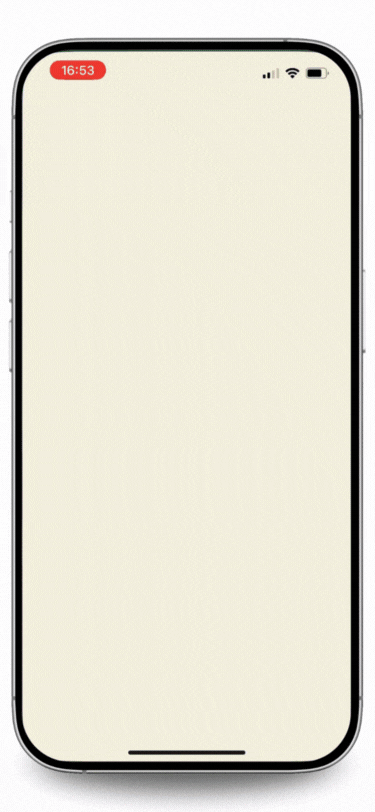
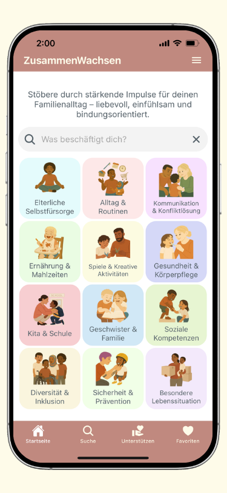
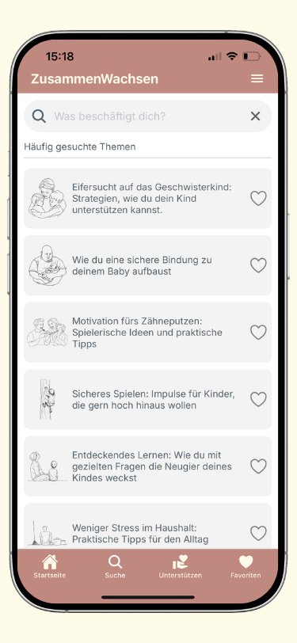
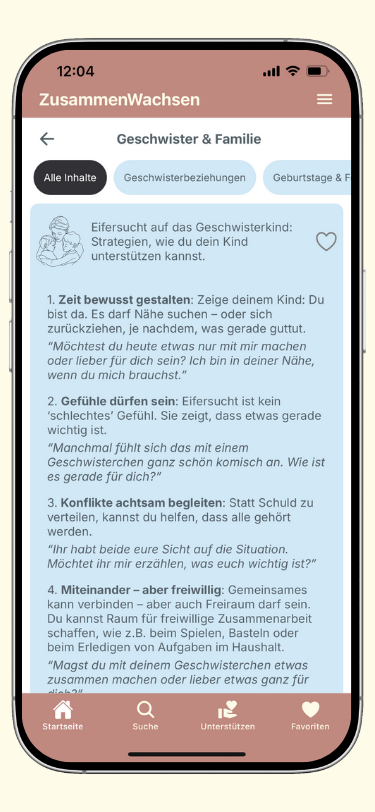
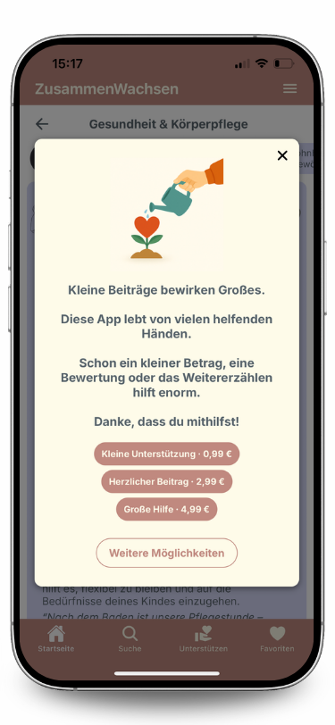

# ZusammenWachsen App

<div align="center">


<br/>
<br/>

[](https://www.zusammenwachsenapp.de/app)
[](https://www.zusammenwachsenapp.de/app)
[](https://reactnative.dev/)
[]()

</div>

---

## 📱 Demo

<div align="center">
  
</div>

<div align="center">
  
  
  
  
</div>

---

## 🎯 Projektziel

Eine Eltern-App mit über 300 Alltagsthemen, die vollständig offline funktioniert, eine schnelle Suche bietet und bewusst ohne externe Tracking-Dienste auskommt.

**Das Projekt zeigt:**
- Mobile Frontend-Entwicklung mit React Native
- Umgang mit Performance, Navigation und State
- Production-ready App mit echten Usern im Store

---

## 📱 Projekt-Übersicht

ZusammenWachsen ist eine React-Native-App, die Eltern im Alltag unterstützt. Die App enthält über 2.500 kurze Impulse zu mehr als 300 Themen, ist komplett offline nutzbar und bietet Suche, Kategorien, Favoriten sowie optionale Spenden per In-App-Purchase.

Die App ist **öffentlich in den App Stores verfügbar** und wird aktiv genutzt.

**Meine Rolle:** Mobile Developer (Solo-Projekt)
- ✅ Komplette Frontend-Entwicklung mit React Native
- ✅ Architektur, State Management und Navigation
- ✅ Integration von Analytics, Error-Tracking und In-App-Purchases
- ✅ Store-Deployment für iOS und Android
- 🤝 Content-Erstellung mit meiner Frau (Pädagogin)

**Zentrale Funktionen:**
- Fuzzy-Suche über 300+ Themen mit Synonym-Unterstützung
- Inhalte entdecken über Kategorien & Unterkategorien oder Suche
- Favoriten mit lokaler Speicherung (AsyncStorage)
- Navigation (Tabs, Drawer, Stacks, Deep Links)
- Datenschutzfreundliche Analytics (eigener HTTPS-Endpoint)
- Offline-First Architektur (lokale JSON-Daten)
- In-App-Purchases für optionale Spenden

---

## 🛠 Tech Stack

**Frontend:**
- JavaScript (ES6+)
- React Native (Expo) – Cross-Platform Development
- React Hooks (useState, useContext, useEffect, Custom Hooks)
- Komponentenbasierte UI-Struktur

**Navigation & State:**
- React Navigation – Stack, Tab, Drawer + Deep Linking
- React Context API – Verwaltung kleiner globaler Zustände (z. B. Favoriten, Popups)
- AsyncStorage – Dauerhaftes Speichern von Favoriten

**Suche & Daten:**
- Fuse.js – Schnelle Offline-Suche über alle Themen (~300)
- Lokale JSON-Daten – Inhalte der App sind offline verfügbar

**Analytics & Fehlerbehandlung:**
- Eigener HTTPS-Analytics-Endpoint – datenschutzfreundliche Event-Erfassung
- Supabase (PostgreSQL, EU-Server) für Event-Speicherung
- Sentry für Error-Tracking in der Produktion

**Wichtige Architektur-Entscheidungen:**
- **Expo:** Schnelle Entwicklung und einfache Builds
- **Context API statt Redux:** Überschaubarer globaler State, keine unnötige Komplexität
- **Custom Analytics:** Eigenes Tracking über HTTPS-Endpoint (Backend: Supabase/PostgreSQL, EU-Server). Nur minimale Event-Daten, keine personenbezogenen Informationen
- **Offline-First:** Alle Inhalte sind lokal gespeichert und die App funktioniert vollständig ohne Internet. Es gibt nur einen kleinen Update-Check beim Start (max. 7 Tage offline)

---

## 💻 Code Highlights

### 1. Schnelle Fuzzy-Suche über mehr als 300 Themen

Die Suche funktioniert vollständig offline und ist auf Nutzerverhalten optimiert (z. B. Tippfehler, unvollständige Begriffe, Negationen).

```javascript
// utils/FuseSearch.js

// Gewichtete Felder für die Fuzzy-Suche (Fragen & Synonyme)
const fuseOptions = {
  keys: [
    { name: 'SynonymQuestionsIndex', weight: 1.0 },
    { name: 'QuestionIndex', weight: 0.4 },
    { name: 'SynonymConceptsIndex', weight: 0.2 }
  ],
  threshold: 0.4,
  ignoreLocation: true
};

// Bereite Such-Text vor: Entferne Füllwörter, behalte Negationen
const preprocessQuery = (query) => {
  const importantWords = ["nicht", "kein", "keine", "ohne", "nein"];
  let words = query.toLowerCase().split(/\s+/);
  
  return words
    .filter(w => !stopwords.includes(w) || importantWords.includes(w))
    .join(' ');
};
```

💡 **Was das zeigt:**
- ✓ Suchlogik-Optimierung für bessere UX
- ✓ Performance-Bewusstsein (Stopwords, aber wichtige Wörter behalten)
- ✓ Library-Integration (Fuse.js)
- ✓ Verständnis für Nutzerverhalten (Negationen sind wichtig)

---

### 2. Favoriten mit „Optimistic UI" – sofortiges Feedback für Nutzer

Beim Speichern einer Frage reagiert die UI sofort. Schlägt das Speichern fehl, wird der Zustand sauber zurückgesetzt.

```javascript
// contexts/SavedQuestionsContext.jsx

const toggleSaveQuestion = async (questionId) => {
  const updatedSavedQuestions = { 
    ...savedQuestions, 
    [questionId]: !savedQuestions[questionId] 
  };

  // Optimistic Update
  setSavedQuestions(updatedSavedQuestions);

  try {
    await AsyncStorage.setItem('savedQuestions', JSON.stringify(updatedSavedQuestions));
  } catch (storageError) {
    // Rollback bei Fehler
    setSavedQuestions(savedQuestions);
    
    // User-Feedback bei vollem Speicher
    if (storageError.message?.includes('QuotaExceededError')) {
      Alert.alert(
        'Speicher voll',
        'Bitte lösche einige Favoriten oder mache Speicherplatz frei.'
      );
    } else {
      // Kritische Fehler an Monitoring senden
      logAsyncStorageError(storageError, ...);
    }
  }
};
```

💡 **Was das zeigt:**
- ✓ State Management mit React Context
- ✓ Optimistic UI Pattern für bessere UX
- ✓ Rollback-Strategie bei Storage-Fehlern
- ✓ Unterscheidung: User-Fehler (Alert) vs. kritische Fehler (Logging)
- ✓ Defensive Programmierung

---

### 3. Kleine UX-Animation für bessere Orientierung (Tabbar-Highlight)

Beim Speichern einer Frage wackelt das Favoriten-Icon in der Tabbar. So verstehen User intuitiv, wo ihre Favoriten zu finden sind.

```javascript
// contexts/FavoriteTabAnimationContext.js

const FavoriteTabAnimationProvider = ({ children }) => {
  const [highlight, setHighlight] = useState(false);

  const triggerHighlight = () => {
    setHighlight(true);
    setTimeout(() => setHighlight(false), 800);
  };

  return (
    <FavoriteTabAnimationContext.Provider value={{ highlight, triggerHighlight }}>
      {children}
    </FavoriteTabAnimationContext.Provider>
  );
};
```

💡 **Was das zeigt:**
- ✓ UX-Fokus (User lernt durch visuelle Hinweise)
- ✓ Animation-Integration
- ✓ Custom Context für Feature-spezifische State
- ✓ Saubere Komponenten-Architektur

---

### 4. Fehler-Logging mit Sentry (Datenschutz-Fokus)

Fehler werden gefiltert, anonymisiert und dedupliziert, bevor sie an Sentry gesendet werden.

```javascript
// utils/logError.js
 
export function logError(error, { tags = {}, extra = {}, severity = 'error' } = {}) {
  const anonymizedMessage = anonymizeErrorMessage(error.message);
  const errorKey = `${error.name}-${anonymizedMessage}`;
 
  // Deduplizierung - verhindert Spam
  if (reportedErrors.has(errorKey)) return;
 
  // Nur kritische Fehler senden
  if (!checkIfCritical(error, tags)) return;
 
  reportedErrors.add(errorKey);
 
  // An Sentry senden, aber ohne sensible Daten
  Sentry.captureException(error, {
    tags: sanitizeTags(tags),
    extra: sanitizeExtra(extra),
    level: severity
  });
}
 
// Entfernt E-Mails, IDs, Tokens aus Fehlermeldungen
function anonymizeErrorMessage(message) {
  return message
    .replace(/user_?\d+/g, 'user_[ID]')
    .replace(/email=[\w.-]+@[\w.-]+/g, 'email=[HIDDEN]')
    .replace(/token=[\w.-]+/g, 'token=[HIDDEN]');
}
```

💡 **Was das zeigt:**
- ✓ Production Best Practices (Datenschutz, kein Spam)
- ✓ Error Management mit Filterung
- ✓ Sentry-Integration
- ✓ DSGVO-Bewusstsein

---

## 🚧 Technische Herausforderungen & Lösungen

### 1. Performance-optimiertes Auto-Scroll in dynamischen FlatLists

**Problem:** Wenn User eine Frage öffnen, soll die App automatisch zum Beginn der Karte scrollen. Bei vielen Einträgen mit dynamischen Card-Höhen führte `scrollToIndex` zu Crashes und UI-Freezes.

**Lösung:**
- Warte bis die Karte fertig gerendert ist, bevor gescrollt wird (InteractionManager)
- Halte nur 5 Bildschirme im Speicher (windowSize={5})
- Lazy Loading (erst 10 Elemente, dann progressiv mehr)
- Zusätzliches Error-Handling für Fälle, in denen scrollToIndex fehlschlägt

### 2. DSGVO-konforme Analytics-Lösung

**Problem:** Keine externen Tracking-Dienste für maximalen Datenschutz.

**Lösung:**
- Eigener HTTPS-Endpoint mit Supabase (PostgreSQL, EU-Server) als Backend
- Strenge Event-Validierung (nur erlaubte Types, keine personenbezogenen Daten)

### 3. Navigation mit Deep Linking

**Problem:** Drawer + Tab + Stack + Deep Links führten zu Navigationsfehlern.

**Lösung:**
- "Safe Stack"-Wrapper mit Error Boundaries
- Fallback-UI bei Rendering-Fehlern
- Navigation-Guards für Parameter-Validierung bei Deep Links

---

## 📁 Projektstruktur

```
zusammenwachsen-app-highlights/
├── App.js
├── components/       # Wiederverwendbare UI-Komponenten
├── contexts/         # State Management (Favorites, Popup, Animation)
├── navigation/       # Tab, Drawer, Stack Navigation
├── screens/          # Screen-Komponenten
├── utils/            # Error Logging, Analytics, Helpers
└── assets/
    └── readme/       # Screenshots & Demo-GIF
```

---

## 📊 Projektzahlen

- **~10 Screens**, **~30 Komponenten**
- **~8.000 – 10.000 Zeilen eigener Frontend-Code**
- **300+ Themen**, **2.500+ Impulse**
- **4 Monate** Entwicklung (+ 8 Monate Content)
- **5.0★** Rating (7 Bewertungen)
- **~100 Downloads** (erste 4 Wochen)

---

## 🎓 Learnings

**Technisch:**
- React Native & Expo in einem echten Produkt
- State Management mit Context API
- Navigation (Stack, Tab, Drawer, Deep Linking)
- Offline-First Architektur
- Performance-Optimierung (FlatList, Lazy Loading)
- Error Handling und Monitoring in Production
- Datenschutzkonforme Analytics aufbauen
- App Store Deployment (iOS + Android)

**Projekt-Management:**
- End-to-End Ownership (Idee → Entwicklung → Launch)
- Iteratives Design basierend auf User-Feedback
- Strukturierung größerer Content-Mengen

---

## 📱 App testen

Die App ist live in den Stores verfügbar:
- https://www.zusammenwachsenapp.de/app

Dieses Repository enthält ausgewählte Code-Highlights.

---

## 📞 Kontakt

[](https://www.linkedin.com/in/philipp-winkler-b959b13a0)

---

<div align="center">

**Solo-Projekt** | React Native | 2025

</div>
